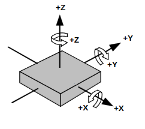

# The Project:
This project is a c++ program that takes position (x,y,z) and orientation (rotX, rotY, rotZ or Euler Angles) data, assumes the object from which this data is taken has  accelerometer and gyroscope sensors attached to its center and turns it into realistic accelerometer and gyroscope data.

## Current status of the project:
### CSV Version
The program iterates through the datapoints from the input csv and calculates the accelerometer and gyroscope values without any added noise. After each calculation it inserts the sensor output to the output csv. The program assumes that the inertial measurement unit (IMU) is placed exactly in the center of the object it is attached to.
### UDP Version 
The program expects tracking points over the UDP socket it creates. Then it turns the obtained data into perfect accelerometer and gyroscope values. Finally it sends the obtained sensor values over via UDP packets to another port (Which can then use these values as needed.).

## Setup
1. Run the included "compile_virtual_sensor_program.sh" script in the root of the directory to compile both the csv version and the udp version of the virtual sensor module:
   - ./ compile_virtual_sensor_program.sh 
2. Run the desired program from the directory root:
   -  ./virtual_sensor_program_csv
   -  ./virtual_sensor_program_udp

## I/O

### CSV:

| Input       | Output |
| ----------- | ----------- |
| A (.csv) file with orientation and position.     | A (.csv) file with accelerometer and gyroscope values.       |
| input.csv: x,y,z,rotX,rotY,rotZ,timestamp  | output.csv: aX,aY,aZ,gX,gY,gZ,timestamp |

### UDP:
| Input       | Output |
| ----------- | ----------- |
| 28 bytes consisting of 6 floats and a ulong| 28 bytes consisting of 6 floats and a ulong      |
| UDP packet: pX,pY,pZ,rotX,rotY,rotZ,timestamp  (where timestamp is a ulong and the rest are floats)  |UDP packet: accX,accY,accZ,gyroX,gyroY,gyroZ,timestamp  (where timestamp is a ulong and the rest are floats)

## Units

| Value               | Units used in Project         |
|---------------------|-------------------------------|
| rotX, rotY, rotZ    | degrees (o)                   |
| pX, pY, pZ          | meters (m)                    |
| accX, accY, accZ    | g (1g = 9.81 m/s^2)           |
| gyroX, gyroY, gyroZ | degrees per seconds (dps)     |
| timestamp           | micro seconds (μs)            |

## Used Reference Frames and Coordinate Systems
This virtual sensor module (VSM) uses the right hand coordinate system where it assumes the axes and the rotations around the axes as is given in the figure below. At initialization the VSM assumes that its axes are perfectly alligned with the axes of the reference frame it uses (This means that the initial position and orientation of the sensor is taken as a global reference frame). The +Z direction of the global reference frame should always be assumed to be pointing upwards (to the opposite from the gravity vector.). 

## TO-DO
 - [ ] Add the conversion from tracking points (position[pX,pY,pZ] + orientation[rotX, rotY, rotZ]) to sensor values(accelerometer[accX, accY, accZ] + gyroscope[gyroX, gyroY, gyroZ]).
    - [x] Calculating the angular velocity from integration of rotX, rotY, rotZ values. 
    - [x] Calculation of acceleration in the x,y,z directions using double derivation of position values.
    - [x] Conversion from linear acceleration calculation to accX, accY, accZ with the rotation matrix.
    - [x] Conversion of the gravity vector to proper accX, accY, accZ with the rotation matrix.
    - [x] Addition of gravity to the obtained accX, accY, accZ values.
 - [ ] Add realistic noise to the obtained sensor values.
 - [ ] Add IMU offset calibration settings.
 - [x] Add the used coordinate system to README.
 - [ ] Bugfixes and fix angles.
 - [ ] Test the system outputs in its current setting.
 - [x] Add taking input tracking points from an internal web socket over UDP.

 ## References
